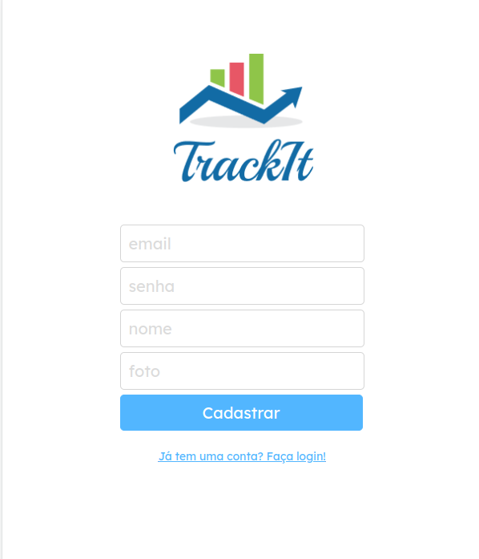
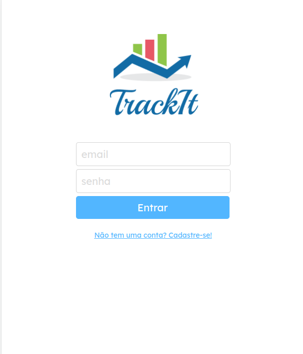
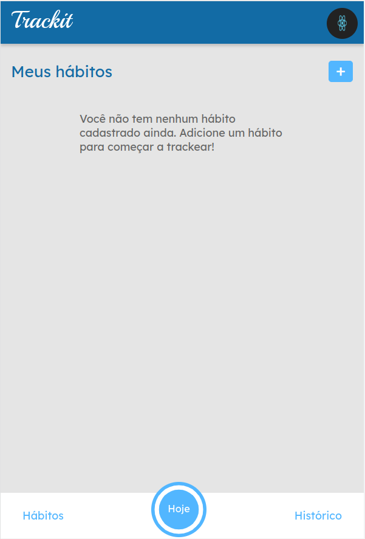
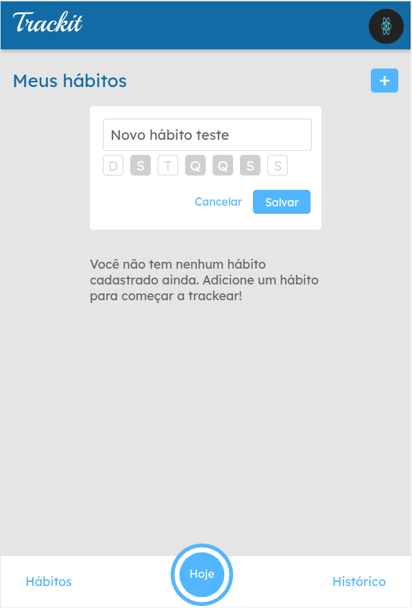
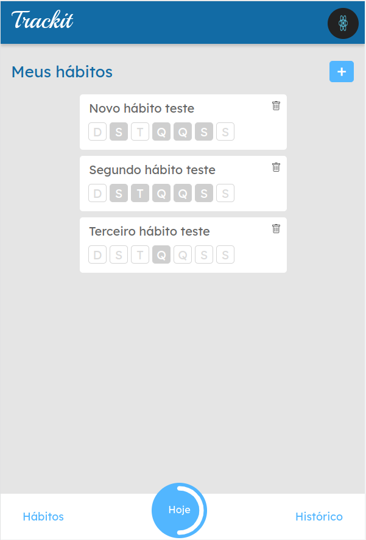
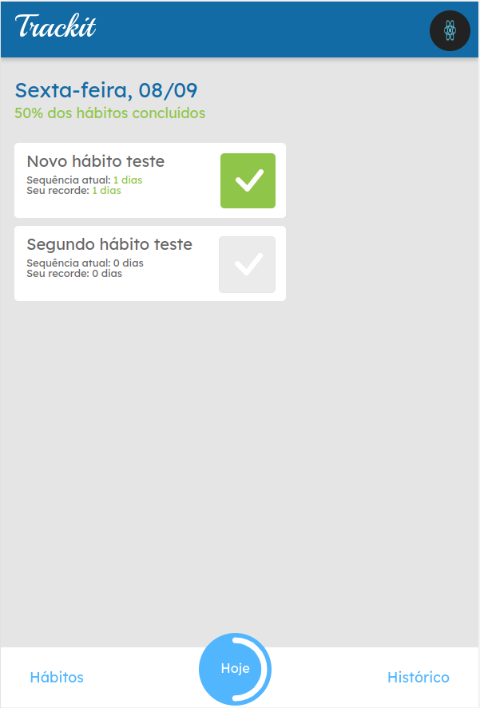
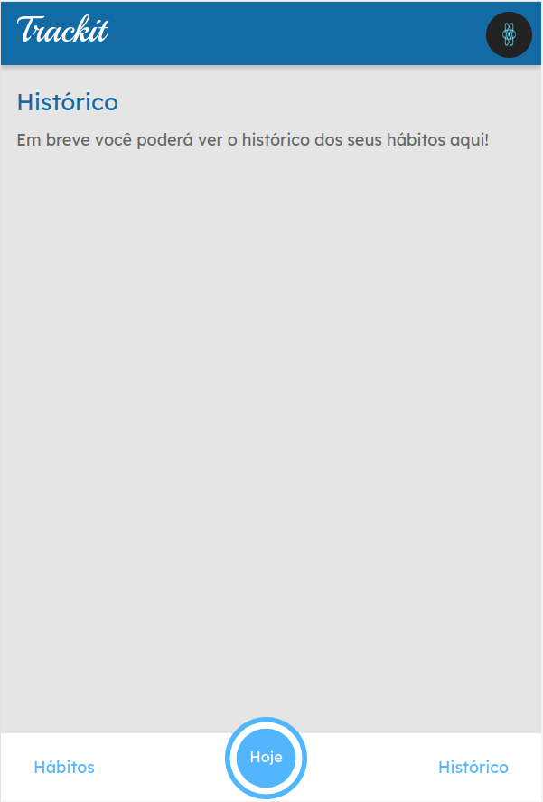

# Trackit
_The Habit Tracker is a comprehensive web application designed to help users establish and monitor their daily habits effectively. It also incorporates secure storage for personal information and provides a seamless user experience_. 
<table>
  <tr>
    <td align="center">
      
      <br />
      Registration Screen
    </td>
    <td align="center">
      
      <br />
      Login Screen
    </td>
  </tr>
  <tr>
    <td align="center">
      
      <br />
      Habits Screen
    </td>
    <td align="center">
      
      <br />
      Create Habits
    </td>
  </tr>
  <tr>
    <td align="center">
      
      <br />
      All habits
    </td>
    <td align="center">
      
      <br />
      Today Screen
    </td>
  </tr>
  <tr>
    <td align="center">
      
      <br />
      History Screen
    </td>
    <td></td>
  </tr>
</table>


Try it out now in front-end at https://projeto11-trackit-alpha-eight.vercel.app/

## About this Project
The Habit Tracker is a web application developed to assist users in establishing and tracking daily habits. The application offers the following pages and functionalities:

- **Login Screen** (`/`)
  - Users can log in by entering their email and password, which are sent to   the API.
  - During the login process, the email and password fields, as well as the login button, are disabled to prevent duplicate actions. A loading animation is displayed during this period.
  - Users also have the option to register by clicking on a link that redirects them to the /register route.

- **Registration Screen** (`/cadastro`)
  - Users can register by entering the required data, which is sent to the API.
  - During the registration process, the fields and the button are disabled, and a loading animation is displayed.
  - In case of a successful registration, users are redirected back to the login route (/).

- **Top and Menu**
  - The top and menu of the application have a fixed position to facilitate navigation.
  - The user's photo is displayed at the top.
  - The menu offers three buttons that redirect users to the /habitos, /hoje, and /historico routes.
  - The "Today" button displays a circular progress bar indicating the percentage of completion of users daily habits. This percentage is automatically updated as habits are completed.

- **Habits Screen** (`/habitos`)
  - Users habits are loaded on screen.
  - Users can delete a habit after confirming the action.
  - If they have no habits registered, an appropriate message is displayed.
  - Users can add a new habit by clicking the "+" button.
  - A habit registration form is displayed, where users enter the habit's name and select the days of the week to perform it.

- **Today Screen** (`/hoje`)
  - Users' habits for the current day are loaded.
  - The screen's title displays the current date.
  - The subtitle displays a phrase based on the user's progress.
  - Users can mark or unmark a habit as completed.

- **History Screen** (`/historico`)
  - Will be the next step to be done in the project.

## Why
This project represents a significant achievement for me, given its comprehensiveness. It encompasses a full-fledged structure in React, a highly relevant and powerful technology. This endeavor has provided me with a deep understanding of this technology and the ability to create a robust web application.

What truly sets this project apart are its well-crafted features and the intricacies of development. Notably, it goes beyond the basics, offering a wide range of functionalities and details that add depth and complexity to the application.

In summary, this project has provided me with a learning experience, allowing me to deepen my knowledge in React, understand the nuances of web application development, and navigate the complexities of implementing features and logic within the context of a React application.

## Technologies
The following badges are the tools and technologies used in the construction of the project: 

- [](https://reactjs.org/)

- [](https://axios-http.com/)

- [](https://styled-components.com/)

- [](https://reactrouter.com/)

- [](https://day.js.org/)

- [](https://www.npmjs.com/package/react-circular-progressbar)

- [](https://www.npmjs.com/package/react-loader-spinner)

## How to run for development

1. Clone this repository
2. Install all dependencies

```bash
npm i
```

3. Populate `.env` file based on `.env.example`. `REACT_APP_API_BASE_URL` should point to the API server

4. Run the front-end in a development environment:

```bash
npm run start
```

## Building and starting for production

```bash
npm run build
npm start
```

## Support

Reactjs is an MIT-licensed open source project. It can grow thanks to the sponsors and support by the amazing backers. If you'd like to join them, please [read more here](https://react.dev/learn).

## Stay in touch

- Github - [@reactGithub](https://github.com/facebook/react)
- Website - [https://react.dev/](https://react.dev/)
- Twitter - [@reactjs](https://twitter.com/reactjs)

## License

This project is [MIT licensed](LICENSE).
